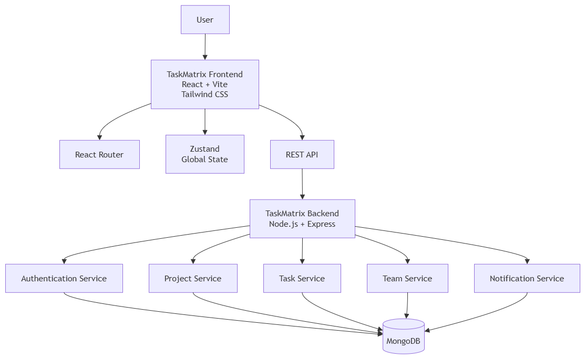

# TaskMatrix

> An Agile Project Management Platform for modern teams.

## Project Overview

TaskMatrix is an enterprise-oriented Agile Project Management application designed to help teams organize projects, manage tasks, collaborate with team members, and monitor project progress through a centralized workspace.

The application is planned around a structured Agile workflow for creating projects, assigning tasks, tracking status, managing priorities, and viewing detailed task information.

---

## Project Information

| Field | Details |
| --- | --- |
| Project Name | TaskMatrix |
| Designated Track | Agile Project Management |
| Project Type | Enterprise Web Application |
| Development Phase | Capstone Planning |
| Repository | Public GitHub Repository |

---

## Tech Stack

### Frontend
- React.js
- Vite
- JavaScript
- Tailwind CSS
- Zustand
- React Router

### Backend
- Node.js
- Express.js
- REST API

### Database
- MongoDB

### Design & Development Tools
- Git
- GitHub
- Figma
- diagrams.net (draw.io)

---

# Product Requirements Document

## 1. Problem Statement

Modern software teams need a centralized platform to manage projects, tasks, team members, deadlines, priorities, and progress.

Managing these activities across separate tools can make it difficult to maintain a clear view of project progress. TaskMatrix is planned as a unified workspace for organizing an Agile workflow from project creation through task completion.

## 2. Target Users

TaskMatrix is designed for:
- Project Managers
- Team Leaders
- Developers
- Designers
- QA Engineers
- Students working in development teams
- Small and medium-sized software teams

## 3. Core Features

### P0 — Mandatory MVP

**Authentication**
- User registration
- User login
- Logout
- Protected application routes
- Basic user profile

**Project Management**
- Create project
- View projects
- Update project
- Delete project
- Project details

**Task Management**
- Create, edit, and delete tasks
- Assign tasks to team members
- Set task priority
- Set task status
- Set due date

**Project Board**
- Backlog
- To Do
- In Progress
- Review
- Done

**Dashboard**
- Total projects
- Total tasks
- Completed tasks
- Pending tasks
- Tasks by priority
- Recent activity

### P1 — Priority Features

**Team Management**
- Add and remove team members
- View team members
- Assign tasks to members

**Task Details**
- Title
- Description
- Status
- Priority
- Assignee
- Due date
- Labels
- Comments
- Activity history

**Search & Filtering**
- Search tasks
- Filter by status
- Filter by priority
- Filter by assignee
- Sort by due date

### P2 — Stretch Features

- Drag-and-drop task management
- Activity timeline
- Notifications
- Dark mode
- Advanced analytics
- Project progress charts
- Role-based permissions
- Real-time collaboration
- Advanced reporting

---

# 4. Application Views

### Authentication
- Login
- Register

### Main Application
- Dashboard
- Projects
- Project Board
- Team Members
- Notifications
- Profile

### Details
- Project Details
- Task Details
- User Details

---

# 5. Project Workflow

```text
Authentication
      ↓
Dashboard
      ↓
Projects
      ↓
Select Project
      ↓
Project Board
      ↓
Create / Select Task
      ↓
Task Details
      ↓
Update Status / Priority / Assignee
      ↓
Task Completed
```

## Task Status Workflow

```text
Backlog → To Do → In Progress → Review → Done
```

---

# 6. UI/UX Wireframes

The Sprint 13 wireframe set contains four core desktop views:

1. Authentication
2. Dashboard
3. Project Board
4. Task Details

### Figma Design

[Open the TaskMatrix Figma Wireframes](https://www.figma.com/design/PMAHqdULAMywdVpkL8mq2k/Untitled?node-id=0-1&t=AN6jbjWv9Agci5P7-1)

---

# 7. System Architecture

TaskMatrix follows a layered full-stack architecture:

```text
User
  ↓
React + Vite Frontend
  ↓
REST API
  ↓
Node.js + Express Backend
  ↓
Application Services
  ↓
MongoDB
```

The backend is planned as separate services/modules for authentication, projects, tasks, team management, and notifications.



---

# 8. Database ERD

The planned MongoDB data model contains five primary collections:

- `users`
- `projects`
- `tasks`
- `comments`
- `notifications`

Important references include:

- `projects.ownerId` → `users._id`
- `projects.memberIds` → `users._id`
- `tasks.projectId` → `projects._id`
- `tasks.assigneeId` → `users._id`
- `comments.taskId` → `tasks._id`
- `comments.userId` → `users._id`
- `notifications.userId` → `users._id`


---

# 9. Mock API Endpoints

## Authentication

```text
POST   /api/auth/register
POST   /api/auth/login
POST   /api/auth/logout
GET    /api/auth/me
```

## Projects

```text
GET    /api/projects
POST   /api/projects
GET    /api/projects/:projectId
PUT    /api/projects/:projectId
DELETE /api/projects/:projectId
```

## Tasks

```text
GET    /api/projects/:projectId/tasks
POST   /api/projects/:projectId/tasks
GET    /api/tasks/:taskId
PUT    /api/tasks/:taskId
DELETE /api/tasks/:taskId
```

## Comments

```text
GET    /api/tasks/:taskId/comments
POST   /api/tasks/:taskId/comments
DELETE /api/comments/:commentId
```

## Users

```text
GET    /api/users
GET    /api/users/:userId
PUT    /api/users/:userId
```

## Notifications

```text
GET    /api/notifications
PUT    /api/notifications/:notificationId/read
```

---

# 10. Frontend State Architecture

Zustand is planned for application-wide state management.

```text
TaskMatrix Application
        ↓
Zustand Global Store
        ├── Auth Store
        │   ├── Current User
        │   └── Authentication Status
        │
        ├── Project Store
        │   ├── Projects
        │   └── Active Project
        │
        ├── Task Store
        │   ├── Tasks
        │   ├── Selected Task
        │   └── Task Filters
        │
        ├── Team Store
        │   ├── Team Members
        │   └── Selected Member
        │
        └── UI Store
            ├── Sidebar State
            ├── Modal State
            └── Theme
```


---

# 11. MongoDB Collection Design

### users
Stores account and profile information.

```text
_id, name, email, passwordHash, avatar, createdAt
```

### projects
Stores project information and membership.

```text
_id, name, description, ownerId, memberIds, createdAt
```

### tasks
Stores project tasks and workflow information.

```text
_id, projectId, title, description, status,
priority, assigneeId, dueDate, createdAt
```

### comments
Stores task-level collaboration messages.

```text
_id, taskId, userId, content, createdAt
```

### notifications
Stores user-specific notifications.

```text
_id, userId, message, type, read, createdAt
```

---

# 12. Architecture Documents

```text
docs/
├── architecture/
│   ├── system-architecture.drawio.png
│   ├── database-erd.drawio.png
│   └── state-tree.drawio.png
│
└── wireframes/
    └── README.md
```

The diagrams are maintained as exported PNG documentation for the planning phase.

---

# 13. Development Priorities

| Priority | Area | Status |
| --- | --- | --- |
| P0 | Authentication | Planned |
| P0 | Project Management | Planned |
| P0 | Task Management | Planned |
| P0 | Project Board | Planned |
| P0 | Dashboard | Planned |
| P1 | Team Management | Planned |
| P1 | Task Details | Planned |
| P1 | Search & Filtering | Planned |
| P2 | Drag & Drop | Planned |
| P2 | Notifications | Planned |
| P2 | Analytics | Planned |
| P2 | Real-time Collaboration | Planned |

---

# 14. Sprint 13 Deliverables

- [x] Project selected — TaskMatrix
- [x] Repository initialized
- [x] PRD prepared
- [x] Figma wireframes planned
- [x] System architecture diagram
- [x] Database ERD
- [x] Frontend state tree
- [x] Mock API endpoint plan
- [x] MongoDB collection plan
- [x] Architecture documentation structure

---

# 15. Future Development Phases

### Phase 1 — Base MVP
Build authentication, project management, task management, dashboard, and project board.

### Phase 2 — Priority Features
Implement team management, detailed task views, search, filtering, and collaboration features.

### Phase 3 — Optimization & Stretch Features
Add analytics, notifications, drag-and-drop workflows, permissions, and real-time capabilities.

### Phase 4 — Quality & Deployment
Testing, security review, performance optimization, deployment, monitoring, and documentation.

---

## Project Status

**Planning & Architecture Phase — Sprint 13**

The current phase focuses on product requirements, UI/UX wireframes, system architecture, database design, API planning, and frontend state architecture.
